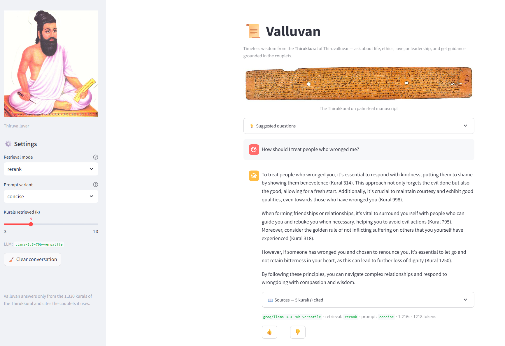
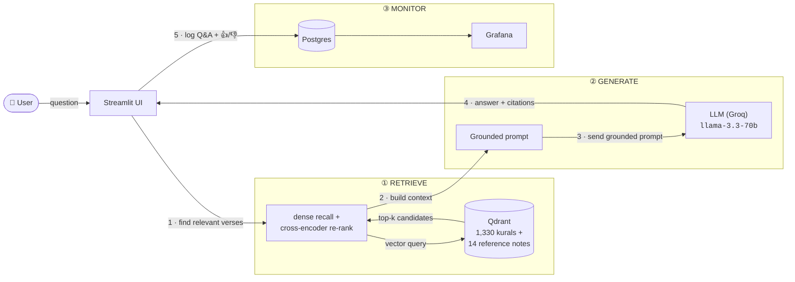
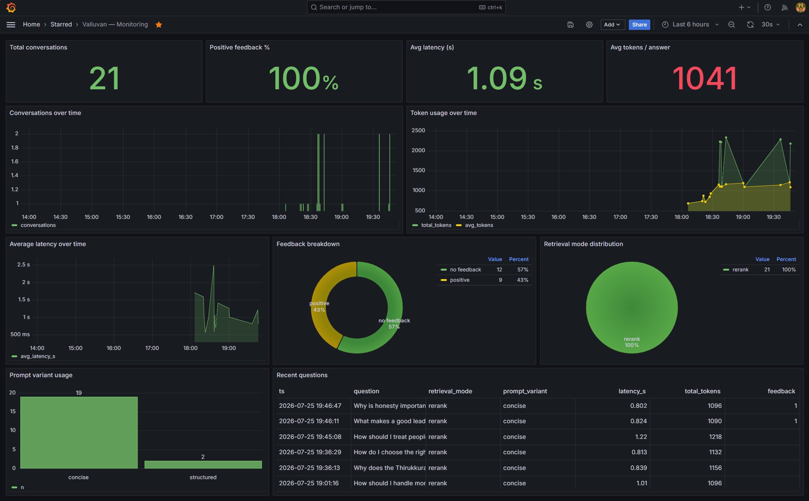

# 📿 Valluvan — Thirukkural Wisdom Assistant

> Ask any life or ethics question and get an answer grounded in the **1,330
> couplets (kurals)** of Thiruvalluvar, with citations.

Valluvan is an end-to-end **Retrieval-Augmented Generation (RAG)** application
built for the [LLM Zoomcamp](https://github.com/DataTalksClub/llm-zoomcamp)
course project. It ingests the Thirukkural (a 2,000-year-old Tamil classic on
ethics, polity, and love), indexes it for **hybrid search**, and uses an LLM to
answer modern questions grounded in the most relevant verses — citing each kural
it relies on.

**▶️ Live demo:** <https://valluvan.streamlit.app>

## Preview

<!-- Screenshot: run `make up`, ask a question in the UI, then capture the
     answer with its cited kurals + feedback buttons. Save as images/streamlit-ui.png -->


*Valluvan answers a life question grounded in the Thirukkural, citing every kural
it used, with retrieval/LLM telemetry and 👍/👎 feedback.*

## Contents

- [Who was Thiruvalluvar, and what is the Thirukkural?](#who-was-thiruvalluvar-and-what-is-the-thirukkural)
- [Why this project?](#why-this-project)
- [Architecture](#architecture)
- [Evaluation criteria](#evaluation-criteria)
- [Tech Stack](#tech-stack)
- [Dataset](#dataset)
- [Prerequisites](#prerequisites)
- [Quick start](#quick-start)
- [How to run each step](#how-to-run-each-step)
- [Configuration](#configuration)
- [Cloud deployment](#cloud-deployment)
- [Project status](#project-status)
- [License / attribution](#license--attribution)

---

## Who was Thiruvalluvar, and what is the Thirukkural?


**Thiruvalluvar** (often simply **Valluvar**) was a celebrated Tamil poet and
philosopher, traditionally believed to have lived in South India between roughly
the 4th century BCE and the 5th century CE. He is one of the most revered figures
in Tamil culture — a 133-foot statue of him stands off the coast of Kanyakumari,
at the southern tip of India.

His single surviving work, the **Thirukkural** (திருக்குறள், "sacred couplets"),
is a masterpiece of world literature. It is a collection of **1,330 couplets
(kurals)** — each just two short lines — organized into **133 chapters
(adhigarams)** of 10 kurals each, grouped under three sections (**paals**):

| Section (Paal)        | Theme                          | Kurals |
|-----------------------|--------------------------------|--------|
| **Aram** (அறம்)       | Virtue / ethics                | 380    |
| **Porul** (பொருள்)    | Wealth, polity & society       | 700    |
| **Inbam** (இன்பம்)    | Love                           | 250    |

What makes the Thirukkural remarkable is its **secular, universal wisdom** — it
speaks to honesty, friendship, leadership, self-control, kindness, and love in a
way that remains strikingly relevant ~2,000 years later, across religions and
cultures. It has been translated into more than 40 languages.

Valluvan brings this timeless wisdom to your fingertips: ask a modern question,
and it answers grounded in the most relevant kurals — with citations.

> *Image: the 133-foot Thiruvalluvar statue at Kanyakumari
> ([Wikimedia Commons](https://commons.wikimedia.org/wiki/File:Thiruvalluvar_Statue_front_view.jpg), CC BY-SA 4.0).*

---

## Why this project?

The Thirukkural's wisdom is timeless, but the verses are terse, archaic, and
spread across 133 chapters — and most people can't read classical Tamil.
Valluvan lets anyone ask a plain-language question (English **or** Tamil) and
receive a grounded, cited answer.

---

## Architecture



Each request follows five steps: **Qdrant** retrieves the most relevant
kurals/notes (step 1); the app builds a grounded prompt from that context (step
2) and sends it to the **LLM (Groq)** (step 3); the LLM returns a cited answer
(step 4); and **Postgres** logs the interaction and 👍/👎 feedback for the
**Grafana** dashboard (step 5). The default retrieval is `rerank` — dense recall
followed by a cross-encoder re-rank — which won the
[retrieval evaluation](docs/retrieval-evaluation.md) over sparse and hybrid.

> Everything except the managed cloud services runs in Docker via a single
> `make up`.

| Component         | Technology                                                |
|-------------------|-----------------------------------------------------------|
| Vector DB         | Qdrant (Docker) — Thirukkural collection with all 1,330 kurals and general information about Thiruvalluvar and the Thirukkural; named `dense` + `sparse` vectors |
| Dense embeddings  | `paraphrase-multilingual-MiniLM-L12-v2` (Tamil + English) |
| Sparse / keyword  | `Qdrant/bm25` — hybrid via Reciprocal Rank Fusion (RRF)   |
| Re-ranker         | `ms-marco-MiniLM-L-6-v2` cross-encoder (default mode)     |
| LLM               | Groq `llama-3.3-70b-versatile` (swappable via env)        |
| Interface         | Streamlit chat UI (`app/streamlit_app.py`)                |
| Monitoring        | Postgres + Grafana dashboard (10 panels)                  |

See [`docs/hybrid-search.md`](docs/hybrid-search.md) for why we store two vectors
per kural, and [`docs/retrieval-evaluation.md`](docs/retrieval-evaluation.md) for
the retrieval evaluation (dense / sparse / hybrid / rerank + query rewriting) and
the resulting decisions.

---

## Evaluation criteria

A quick map of every LLM Zoomcamp grading criterion to where it is satisfied in
this project, so evaluators can find the evidence fast.

| Criterion | Pts | Where it's covered |
|-----------|:---:|--------------------|
| **Problem description** | 2 | [Who was Thiruvalluvar](#who-was-thiruvalluvar-and-what-is-the-thirukkural) + [Why this project?](#why-this-project) — a clear, well-scoped problem |
| **Retrieval flow** | 2 | Knowledge base (Qdrant, 1,330 kurals) **and** LLM (Groq) — see [Architecture](#architecture); code in [`rag/search.py`](rag/search.py) + [`rag/rag.py`](rag/rag.py) |
| **Retrieval evaluation** | 2 | Dense / sparse / hybrid / rerank compared (hit-rate + MRR); best = rerank. [`docs/retrieval-evaluation.md`](docs/retrieval-evaluation.md), `make eval-retrieval` |
| **LLM evaluation** | 2 | Multiple prompt variants judged (LLM-as-judge; concise won). [`docs/llm-evaluation.md`](docs/llm-evaluation.md), `make eval-llm` |
| **Interface** | 2 | Streamlit chat UI ([`app/streamlit_app.py`](app/streamlit_app.py)) — [live demo](https://valluvan.streamlit.app) |
| **Ingestion pipeline** | 2 | Automated Python script [`ingestion/ingest.py`](ingestion/ingest.py) (idempotent, one-shot Docker service) |
| **Monitoring** | 2 | User 👍/👎 feedback **and** a 10-panel Grafana dashboard — [Monitoring](#monitoring--postgres--grafana), [`docs/monitoring.md`](docs/monitoring.md) |
| **Containerization** | 2 | Whole stack in [`docker-compose.yml`](docker-compose.yml) — `make up` |
| **Reproducibility** | 2 | Clear step-by-step [Quick start](#quick-start), committed dataset, all deps pinned in `requirements*.txt` |
| **Best practices** | +3 | Hybrid search, cross-encoder re-ranking, **and** query rewriting — all evaluated ([`docs/retrieval-evaluation.md`](docs/retrieval-evaluation.md)) |
| **Cloud deployment** (bonus) | +2 | Full stack live on free managed services — [live demo](https://valluvan.streamlit.app), [`docs/deployment.md`](docs/deployment.md) |

---

## Tech Stack

### Large Language Model (answer generation)

- **Default:** [Groq](https://console.groq.com/) serving
  **`llama-3.3-70b-versatile`** — Meta's Llama 3.3 70B, accessed through Groq's
  fast inference API. Used to read the retrieved kurals and write a grounded,
  cited answer (`rag/rag.py`).
- **Why Groq:** generous free tier, very low latency (~1–2 s), and an
  **OpenAI-compatible API**, so the same client code works for other providers.
- **Swappable via `.env`** (`LLM_PROVIDER`, `LLM_MODEL`) with zero code changes:
  - `openai` → e.g. `gpt-4o-mini`
  - `ollama` → fully local, e.g. `llama3.1`
- **Evaluation model:** `llama-3.1-8b-instant` is also used for bulk offline jobs
  (ground-truth question generation, LLM-as-judge) to stay within daily quotas.
- **Prompting:** two prompt variants (`concise`, `structured`) are defined and
  compared with an LLM-as-judge — see
  [`docs/llm-evaluation.md`](docs/llm-evaluation.md).

### Vector database

- **[Qdrant](https://qdrant.tech/)** (v1.10.1), run as a **Docker container** via
  `docker-compose.yml`. Data persists in a named Docker volume
  (`qdrant_storage`).
- One collection (`thirukkural`) holds all **1,330 kurals** plus **14 reference
  notes** with general information about Thiruvalluvar and the Thirukkural.
  Each record is stored with **two named vectors** and its full content and
  metadata as payload.
- Qdrant performs **native hybrid search**: dense + sparse retrieval fused with
  **Reciprocal Rank Fusion (RRF)** in a single query (its Query API), so no
  external search engine is needed.
- Ports: `6333` (REST + web dashboard at `http://localhost:6333/dashboard`),
  `6334` (gRPC).

### Embedders & reranker

The embedders and cross-encoder reranker all run **locally** via
[`fastembed`](https://github.com/qdrant/fastembed) — no API cost, no external
calls during ingestion, search, or re-ranking.

| Stage    | Model                                                        | Dim | Role                                             |
|----------|--------------------------------------------------------------|-----|--------------------------------------------------|
| `dense`  | `sentence-transformers/paraphrase-multilingual-MiniLM-L12-v2`| 384 | Semantic similarity; multilingual (Tamil + English) |
| `sparse` | `Qdrant/bm25`                                                | —   | Lexical / keyword matching (BM25)                |
| rerank   | `Xenova/ms-marco-MiniLM-L-6-v2` (cross-encoder)              | —   | Re-scores the top candidates for precision       |

- The **dense** model is multilingual, so a question in **English or Tamil** can
  match the relevant verse regardless of the language it was written in.
- The **sparse** BM25 model captures exact-term overlap; combining the two gives
  hybrid search (rationale in [`docs/hybrid-search.md`](docs/hybrid-search.md)).
- The **cross-encoder reranker** reads the query and each candidate *together*
  for a precise relevance score — used in two-stage retrieval (dense recall →
  rerank). It measurably beats plain dense; see
  [`docs/reranking.md`](docs/reranking.md).
- Embedding text per kural fuses the terse couplet with its English translation
  and prose explanation so short verses gain enough semantic body.

### Supporting tools

| Layer              | Technology                                             |
|--------------------|--------------------------------------------------------|
| Ingestion          | Python script (`ingestion/ingest.py`) + `fastembed`    |
| RAG / retrieval    | `qdrant-client`, OpenAI-compatible client (`openai`)   |
| Data prep          | `pandas` + `pyarrow` (local parquet normalization only) |
| Interface          | **Streamlit** chat UI (`app/streamlit_app.py`)         |
| Monitoring         | Postgres + Grafana (`app/db.py`, `monitoring/grafana/`) |
| Orchestration      | Docker Compose (full stack: app + ingest + qdrant + postgres + grafana) |
| Containerization   | `Dockerfile` (shared by the `app` and one-shot `ingest` services) |

---

## Dataset

Source: [`yuvarajvelmurugan/thirukkural`](https://huggingface.co/datasets/yuvarajvelmurugan/thirukkural)
on Hugging Face — a fully bilingual, complete (1,330 rows, zero nulls) edition
with Tamil + English for every section, chapter (adhigaram), verse, translation,
and commentary. The Thirukkural itself is in the **public domain**.

- Raw source: `data/thirukkural_hf.parquet`
- Canonical, normalized records: `data/thirukkural.json` (produced by
  `ingestion/normalize.py`)

### Reference knowledge documents

The 1,330 kurals are terse couplets — they don't state facts *about* the
Thirukkural itself (e.g. "how many kurals are there?", "who was Thiruvalluvar?",
"what is the statue at Kanyakumari?"). To answer those meta-questions, the
ingestion pipeline also loads a small curated set of **reference notes** from
[`data/knowledge.json`](data/knowledge.json) (facts sourced from Wikipedia on
the Thirukkural, Thiruvalluvar, book structure, translations, and landmarks).
They are embedded into the **same Qdrant collection** with `type: "knowledge"`
and cited in answers as *(Reference)* — so both individual verses and
book-level facts are retrievable. This is part of every setup automatically (no
extra step).

---

## Prerequisites

- **Docker** — runs the full stack (Qdrant, Postgres, Grafana, and the app itself)
- **Python 3.10+** and [`uv`](https://github.com/astral-sh/uv) — only for the
  local-dev / evaluation workflow (Option B); not needed for `make up`
- A free **Groq API key** — get one at https://console.groq.com/keys

---

## Quick start

### Option A — Everything in Docker (recommended)

The whole stack (Qdrant, Postgres, Grafana, one-shot ingestion, and the Streamlit
app) runs with a single command:

```bash
make env                       # create .env, then set GROQ_API_KEY=gsk-...
make up                        # build + start the entire stack
```

`make up` builds the app image, waits for Qdrant/Postgres to be healthy, runs a
**one-shot `ingest`** service (idempotent — skips if the collection is already
populated), then launches the app. Once it's up:

- **App** → <http://localhost:8501>
- **Grafana** → <http://localhost:3000> (login `admin` / `admin`)

```bash
make ps        # check service status
make logs      # tail logs
make down      # stop everything (keeps data)
make clean     # stop AND delete all data volumes
```

### Option B — Local Python (for development / evaluation)

Every step has a `make` target. Run `make help` to see them all.

```bash
# 1. Create the virtualenv and install dependencies
make venv
make install

# 2. Create your .env and add your Groq key
make env
#    then edit .env and set: GROQ_API_KEY=gsk-...

# 3. Start Qdrant (vector database)
make qdrant-up

# 4. Ingest the Thirukkural into Qdrant (dense + sparse vectors)
make ingest

# 5. Ask Valluvan a question
make rag Q="How can I control my anger?"
```

---

## How to run each step

### Environment & dependencies
```bash
make venv       # create .venv via uv
make install    # install pinned deps from requirements.txt
make env        # copy .env.example -> .env (then add GROQ_API_KEY)
```

### Qdrant (vector database)
```bash
make qdrant-up    # start the Qdrant container
make qdrant-logs  # tail its logs
make dashboard    # print the web dashboard URL (http://localhost:6333/dashboard)
make qdrant-down  # stop it (data is kept in a Docker volume)
```
Qdrant runs as a Docker container defined in `docker-compose.yml`. Your data
persists in the `qdrant_storage` volume across restarts; it is only deleted by
`make clean`.

### Data preparation (optional — output is committed)
```bash
make normalize   # regenerate data/thirukkural.json from the raw parquet
```

### Ingestion
```bash
make ingest      # embed all 1,330 kurals + 14 reference notes (dense + sparse)
                 # and upsert them to Qdrant (idempotent; FORCE_REINGEST=true rebuilds)
```

### Retrieval (compare modes)
```bash
make search Q="about true friendship"
# prints top results for DENSE vs SPARSE vs HYBRID side by side
```

### Ask Valluvan (full RAG)
```bash
make rag Q="What does Thirukkural teach about leadership?"
# retrieves kurals, builds a grounded prompt, calls the LLM,
# and prints an answer that cites kural numbers + telemetry
```

### Evaluation
```bash
make eval-ground      # generate the retrieval ground-truth dataset (LLM)
make eval-retrieval   # hit-rate / MRR for dense / sparse / hybrid / rerank
make eval-rewrite     # measure LLM query rewriting (raw vs rewritten, sampled)
make eval-llm         # LLM-as-judge comparison of prompt variants
```

### Interface — Streamlit chat UI
```bash
make qdrant-up   # ensure the vector DB is running
make app         # launch the Streamlit chat UI at http://localhost:8501
```
Ask a life/ethics question; Valluvan replies grounded in the Thirukkural and
**cites the kurals it used**. Each answer includes:
- a **📖 Sources** expander (Tamil verse, transliteration, English translation
  and meaning, chapter) for every cited kural,
- **telemetry** (retrieval mode, prompt variant, model, latency, tokens), and
- **👍/👎 feedback** buttons — logged via `app/storage.py` for monitoring.

The sidebar lets you switch retrieval mode / prompt variant and `k` on the fly
(defaults are the evaluation winners: `rerank` + `concise`).

### Monitoring — Postgres + Grafana
```bash
make monitoring-up   # start Postgres + Grafana (dashboard auto-provisioned)
make app             # ask questions and rate answers 👍/👎
make grafana         # print the Grafana URL
```
Open Grafana at <http://localhost:3000> (login `admin` / `admin`) → the
**Valluvan — Monitoring** dashboard. It has **10 panels** covering usage
(volume, retrieval-mode & prompt distribution), performance (latency, tokens),
and quality (👍/👎 feedback). Storage is env-driven: it uses Postgres when
`POSTGRES_HOST` is set (local **or** a managed cloud DB like Neon), and
falls back to a local JSONL file otherwise. See
[`docs/monitoring.md`](docs/monitoring.md).

<!-- Screenshot: open the "Valluvan — Monitoring" dashboard in Grafana (after a
     few queries so panels have data) and capture it. Save as images/grafana-dashboard.png -->


### Full stack / teardown
```bash
make up          # build + start the ENTIRE stack (qdrant, postgres, grafana, ingest, app)
make ps          # show service status
make logs        # tail all logs
make down        # stop all services (keeps data)
make clean       # stop AND delete data volumes (Qdrant/Postgres/Grafana/models)
```
See [Quick start → Option A](#option-a--everything-in-docker-recommended) for the
one-command containerized workflow.

---

## Configuration

All configuration is via `.env` (see `.env.example`). Key variables:

| Variable            | Purpose                                    | Default                                                    |
|---------------------|--------------------------------------------|------------------------------------------------------------|
| `LLM_PROVIDER`      | `groq` \| `openai` \| `ollama`             | `groq`                                                     |
| `LLM_MODEL`         | Chat model name                            | `llama-3.3-70b-versatile`                                  |
| `GROQ_API_KEY`      | Groq API key                               | —                                                          |
| `RETRIEVAL_MODE`    | `rerank` \| `dense` \| `sparse` \| `hybrid`| `rerank`                                                  |
| `REWRITE_QUERY`     | Rewrite messy input before retrieval       | `false`                                                    |
| `PROMPT_VARIANT`    | `concise` \| `structured`                  | `concise`                                                  |
| `QDRANT_URL`        | Qdrant endpoint                            | `http://localhost:6333`                                    |
| `QDRANT_COLLECTION` | Collection name                            | `thirukkural`                                              |
| `EMBEDDING_MODEL`   | Dense embedding model                      | `sentence-transformers/paraphrase-multilingual-MiniLM-L12-v2` |
| `SPARSE_MODEL`      | Sparse (BM25) model                        | `Qdrant/bm25`                                              |
| `RERANK_MODEL`      | Cross-encoder reranker                     | `Xenova/ms-marco-MiniLM-L-6-v2`                            |
| `MONITORING_DB`     | `auto` \| `postgres` \| `jsonl`            | `auto`                                                     |
| `POSTGRES_HOST`     | Postgres host (local or cloud, e.g. Neon)     | `localhost`                                             |
| `POSTGRES_SSLMODE`  | `prefer`/`disable` local, `require` for cloud | `prefer`                                                |

To switch the LLM to OpenAI: set `LLM_PROVIDER=openai`, `LLM_MODEL=gpt-4o-mini`,
and `OPENAI_API_KEY`. For a fully local setup use `LLM_PROVIDER=ollama`.

---

## Cloud deployment

Valluvan runs on free managed services with **no code changes** — everything is
env-driven, so only secrets differ from local:

- **Streamlit Community Cloud** — the app (`app/streamlit_app.py`)
- **Qdrant Cloud** — the vector database (1,330 kurals + 14 reference notes
  about Thiruvalluvar and the Thirukkural)
- **Groq** — the LLM
- **Neon** — monitoring Postgres → **Grafana Cloud** dashboard

Full step-by-step (accounts, ingestion into Qdrant Cloud, Streamlit secrets,
Grafana datasource) is in [`docs/deployment.md`](docs/deployment.md).

---

## Project status

- [x] Data ingestion (bilingual Thirukkural → Qdrant, dense + sparse)
- [x] Hybrid retrieval (dense / sparse / RRF)
- [x] Grounded RAG with kural citations (Groq)
- [x] Retrieval evaluation (dense / sparse / hybrid / rerank → rerank)
- [x] LLM evaluation (prompt variants via LLM-as-judge → concise)
- [x] Best practices: hybrid search, cross-encoder re-ranking, query rewriting (all evaluated)
- [x] Streamlit chat UI (cited sources, telemetry, 👍/👎 feedback)
- [x] Monitoring (Postgres + Grafana, 10-panel dashboard)
- [x] Full containerization (`make up` runs the entire stack in Docker)
- [x] Cloud deployment (bonus) — [live on Streamlit Cloud](https://valluvan.streamlit.app) (Qdrant Cloud + Groq + Neon Postgres + Grafana Cloud)

---

## License / attribution

The Thirukkural is in the public domain. Dataset courtesy of the Hugging Face
dataset linked above. This project is built for educational purposes as part of
the DataTalksClub LLM Zoomcamp.

The reference notes in [`data/knowledge.json`](data/knowledge.json) are factual
summaries adapted from Wikipedia articles on the Thirukkural, Thiruvalluvar, and
related topics (each note records its source URL), available under
[CC BY-SA](https://creativecommons.org/licenses/by-sa/4.0/).

### Image credits

- Thiruvalluvar statue at Kanyakumari (README) — photo by Kumarendra,
  [CC BY-SA 4.0](https://creativecommons.org/licenses/by-sa/4.0), via Wikimedia
  Commons.
- Sidebar portrait of Thiruvalluvar (Streamlit app) — art by Kmm.azzam,
  [CC BY-SA 3.0](https://creativecommons.org/licenses/by-sa/3.0), via Wikimedia
  Commons.
- Palm-leaf Thirukkural banner — public domain, via Wikimedia Commons.
